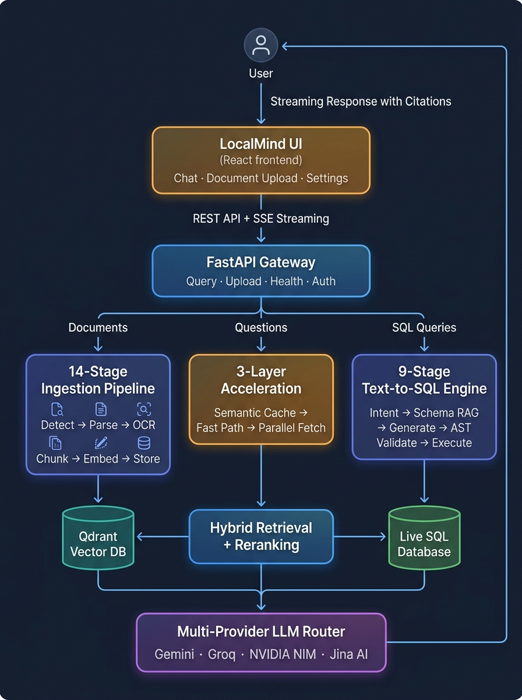

# GlobleMind (LocalMind)

<div align="center">

**Enterprise-Grade Zero-Cost Hybrid RAG & Cognitive Text-to-SQL Pipeline**

*Operates entirely on forever-free-tier APIs while rivaling paid, state-of-the-art enterprise systems in accuracy, security, latency, and throughput.*

[](https://www.python.org/)
[](https://fastapi.tiangolo.com/)
[](https://react.dev/)
[](https://vitejs.dev/)
[](https://qdrant.tech/)
[](https://opensource.org/licenses/MIT)

[](https://github.com/Mihirmaru22/Global_Mind)
[-brightgreen?style=flat-square)](https://github.com/Mihirmaru22/Global_Mind)
[-blueviolet?style=flat-square)](https://github.com/Mihirmaru22/Global_Mind)
[](https://github.com/Mihirmaru22/Global_Mind)
[-success?style=flat-square)](https://github.com/Mihirmaru22/Global_Mind)
[](https://github.com/Mihirmaru22/Global_Mind)

</div>

---

## 📑 Table of Contents

1. [Executive Summary & Core Philosophy](#-executive-summary--core-philosophy)
2. [High-Level System Architecture](#-high-level-system-architecture)
3. [Core Engine 1: 14-Stage Ingestion Pipeline](#-core-engine-1-14-stage-ingestion-pipeline)
4. [Core Engine 2: 9-Stage Cognitive Text-to-SQL Engine](#-core-engine-2-9-stage-cognitive-text-to-sql-engine)
5. [3-Layer Latency Acceleration Architecture](#-3-layer-latency-acceleration-architecture)
6. [Quality Guardrails & Security Defenses](#-quality-guardrails--security-defenses)
7. [Intelligent Multi-Provider LLM Routing & Key Pools](#-intelligent-multi-provider-llm-routing--key-pools)
8. [Benchmark & Evaluation Suite](#-benchmark--evaluation-suite)
9. [Modern React Frontend (LocalMind UI)](#-modern-react-frontend-localmind-ui)
10. [Observability, Tracing & Telemetry](#-observability-tracing--telemetry)
11. [Complete REST API Reference](#-complete-rest-api-reference)
12. [CLI Reference](#-cli-reference)
13. [Developer & Operations Scripts](#-developer--operations-scripts)
14. [Repository Directory Structure](#-repository-directory-structure)
15. [Getting Started & Installation](#-getting-started--installation)
16. [Configuration Reference (.env)](#-configuration-reference-env)
17. [Production Deployment Guide](#-production-deployment-guide)
18. [Concurrency, Portability & Safety](#-concurrency-portability--safety)
19. [Running Tests](#-running-tests)
20. [License](#-license)

---

## 💡 Executive Summary & Core Philosophy

Enterprise knowledge bases and analytical databases pose severe challenges to traditional LLM implementations:
- **Unstructured Documents** contain multi-column prose, complex nested tables, embedded charts, and scanned pages that defeat naive chunking and flat retrieval.
- **Enterprise Relational Databases (ERP/MES)** feature 50–100+ normalized tables, polymorphic entities (e.g., `party` holding both customers and suppliers), denormalization gaps (no precomputed order totals), soft-deletes, implicit joins, and cryptic enum codes (`'P'`, `'V'`, `'B'`).
- **Commercial API Costs & Vendor Lock-In** cause spiraling token bills, strict provider rate limits, and service disruptions when relying on a single closed-source API.

**GlobleMind** (branded as **LocalMind** in the UI) solves these challenges under a strict constraint:
> **It must operate entirely on forever-free-tier APIs while rivaling paid, state-of-the-art enterprise systems in accuracy, resiliency, latency, and safety.**

By combining **dynamic multi-provider routing**, a **14-stage ingestion pipeline**, a **9-stage cognitive Text-to-SQL engine**, a **3-layer latency acceleration architecture**, and **AST-level mathematical query validation**, GlobleMind delivers sub-second response times, 96.3% Text-to-SQL accuracy, and 100% defense against adversarial injections without spending a single dollar on LLM inference.

---

## 🏛️ High-Level System Architecture

GlobleMind's unified orchestrator bridges unstructured document RAG and structured transactional databases into a single coherent cognitive interface:

<div align="center">
  
  <br>
  <em>End-to-end data flow: from user interaction through ingestion, retrieval, and LLM synthesis.</em>
</div>

---

## 📄 Core Engine 1: 14-Stage Ingestion Pipeline

Unstructured documents undergo a rigorous, stage-decoupled ingestion pipeline (`src/pipeline/ingestion.py` and `src/stages/`). If any stage fails, the document is rejected cleanly without corrupting the vector database.

```text
[Input File] ──> s01: MIME Detection ──> s02: Classification ──> s03: Parsing
                     │                                                │
                     ├── Scanned? ──> s04: OCR.space Fallback ────────┤
                     │                                                │
                     ├── Multi-Column? ──> s05: Layout Analysis ──────┤
                     │                                                │
                     ├── Tabular Data? ──> s06: Camelot Extraction ───┤
                     │                                                │
                     └── Charts/Images? ─> s07/s08: Vision Captions ──┘
                                                │
                                                ▼
                                   s09: Semantic Token Chunking
                                                │
                                                ▼
                              s10: Jina V3 Dense + Sparse Vectors
                                                │
                                                ▼
                           s11: Qdrant Cloud Hybrid Index Commit (RRF)
```

### Ingestion Stages Breakdown:

1. **Secure File Detection (`s01_file_detection.py`)**:
   - Uses `python-magic` and `filetype` to inspect real file headers and MIME types.
   - Prevents file spoofing across PDF, DOCX, PPTX, XLSX, CSV, TSV, Markdown, Plaintext, HTML, XML, JSON, and common image formats.
2. **Zero-Shot Classification (`s02_classification.py`)**:
   - Classifies documents (e.g., Financial Report, Scientific Whitepaper, Legal Agreement, Technical Manual) to parameterize downstream chunking and extraction heuristics.
3. **Deep Text Extraction (`s03_parsing.py`)**:
   - Employs PyMuPDF (`fitz`) and `pdfplumber` for PDFs, `python-docx` for Word documents, `python-pptx` for PowerPoint decks, and `openpyxl` for Excel spreadsheets.
4. **OCR Fallback (`s04_ocr.py`)**:
   - Evaluates text yield; if the document is a scanned image or text extraction confidence falls below `OCR_CONFIDENCE_THRESHOLD` (0.75), seamlessly routes pages to the `OCR.space` API (25,000 free requests/month).
5. **Layout & Multi-Column Analysis (`s05_layout.py`)**:
   - Sends dense multi-column pages to Gemini 2.5 Flash Vision to determine natural reading flow and strip recurring headers and footers.
6. **High-Fidelity Table Extraction (`s06_tables.py`)**:
   - Uses `camelot-py` lattice/stream heuristics and vision models to parse complex tables into clean, structural Markdown tables.
7. **Visual & Chart Analysis (`s07_s08_visuals.py`)**:
   - Detects and crops charts, graphs, and figures from document pages.
   - Dispatches parallel requests (`asyncio.gather` bounded by an asynchronous semaphore) to Vision LLMs (Gemini / NVIDIA NIM Llama 3.2 Vision) to generate exhaustive contextual captions embedded into the text flow.
8. **Semantic Chunking (`s09_chunking.py`)**:
   - Splits content into target token blocks (~500 tokens) with fractional overlap (~12%) while respecting sentence and paragraph boundaries.
9. **Dual-Representation Embeddings (`s10_embeddings.py`)**:
   - Sends chunks to Jina AI's V3 model to generate **1024-dimensional dense semantic vectors** alongside **lexical sparse vectors** for precise keyword matching.
10. **Vector Store Commit & RRF (`s11_vector_store.py`)**:
    - Upserts dense and sparse vectors with complete payload metadata into Qdrant Cloud. Enables **Reciprocal Rank Fusion (RRF)** for hybrid search.
11. **Hybrid Retrieval (`s12`)**:
    - Pulls top 50 candidates using dense cosine similarity and sparse BM25 scores, enforcing document diversity and exhaustive query detection.
12. **Cross-Encoder Reranking (`s13`)**:
    - Re-scores candidates using Jina's Cross-Encoder Reranker, selecting the top 25 contextually most relevant chunks.
13. **Generative Synthesis & Citations (`s14`)**:
    - Feeds the top reranked chunks into the `ProviderRouter`. Automatically generates inline footnote citations (`[1]`, `[2]`) and formats outputs with Markdown tables and inline Mermaid diagrams.

### Content-Addressed Identity & Deduplication

- Every uploaded document is hashed with **SHA-256**.
- The ingestion registry (`src/core/ingestion_registry.py`) records hashes in Qdrant payloads (durable across redeployments) and local state (`data/ingested_files.json`).
- Byte-identical re-uploads are automatically skipped with zero duplicate embeddings or wasted API calls.
- Files placed in `data/inbox/` can be automatically ingested on startup (`AUTO_INGEST_ON_STARTUP=true`) or continuously scanned in the background (`AUTO_INGEST_INTERVAL_SECONDS=60`).

---

## 🗄️ Core Engine 2: 9-Stage Cognitive Text-to-SQL Engine

Standard Text-to-SQL approaches fail on enterprise databases because real schemas are heavily normalized, historically patched, and full of business nuances. GlobleMind deploys a deterministic, 9-stage cognitive architecture (`src/stages/s12b_sql_retrieval.py`):

```text
[User Natural Query] 
        │
        ▼
[Stage 1: Semantic Intent Extraction] ──> Metrics, Dimensions, Filters, Directionality
        │
        ▼
[Stage 2: Hybrid Schema RAG] ───────────> Behavioral Atlas & Domain Concept Anchoring
        │
        ▼
[Stage 3: Dynamic Glossary & Joins] ────> 835 Column Mappings & 162 FK Relationship Paths
        │
        ▼
[Stage 4: Dialect-Aware Generation] ────> SQLite / MySQL Prompt Synthesis
        │
        ▼
[Stage 5: AST Validation Gate] ─────────> sqlglot SELECT-Only & Soft-Delete Enforcement
        │                          │
      (Pass)                    (Fail) ──> [Stage 6: Delta Self-Repair Loop] (<400 tokens)
        │                          │                     │
        ▼                          ◄─────────────────────┘
[Stage 7: Safe Execution Engine] ───────> Read-Only Async DB Query (25s Timeout)
        │
        ▼
[Stage 8: Context Capping & Format] ────> 500-Row Clamp & Localized Markdown Tables
        │
        ▼
[Stage 9: Multi-Dialect Synthesis] ─────> Integrated into Final Answer Context
```

### The 9 Execution Stages:

1. **Semantic Intent & Directionality Extraction**:
   - Decouples conversational phrasing from database syntax. Extracts metrics, dimensions, filters, time periods, and aggregations.
   - **Directionality Disambiguation**: Resolves ambiguous verbs like *"bought"*:
     - *"Who bought from us?"* $\rightarrow$ Customer Sales (`sales_order`).
     - *"What did we buy from suppliers?"* $\rightarrow$ Procurement (`purchase`).
2. **Hybrid Schema RAG & Anchor Injection**:
   - Employs a **Behavioral Schema Atlas** (`config/behavioral_schema_atlas.json`) covering 70 enterprise tables.
   - Uses hybrid dense + sparse retrieval to dynamically inject only the relevant table DDLs, keeping schema context within a strict **1,500-token budget**.
3. **Dynamic Enum Glossary & 1-Hop Foreign Key Graph Expansion**:
   - Leverages `config/sql_glossary.json` (835 physical column mappings) and `config/sql_relationships.json` (162 foreign-key join paths).
   - Resolves multi-table joins without LLM hallucinations. Correctly maps business acronyms (e.g., `'P'` = pending carton verification, `'V'` = verified).
4. **Dialect-Aware Text-to-SQL Generation**:
   - Generates database-specific SQL tailored to the configured dialect (`sqlite` or `mysql`) using live system date and dynamic few-shot exemplars.
5. **Multi-Stage AST Validation Gate (`sqlglot`)**:
   - **Strict Read-Only Enforcement**: Rejects any AST containing `INSERT`, `UPDATE`, `DELETE`, `DROP`, `ALTER`, `GRANT`, `INTO OUTFILE`, or `LOAD_FILE`.
   - **CTE Table Shadowing Protection**: Prevents malicious Common Table Expressions designed to spoof physical table names and bypass column security.
   - **Cartesian Explosion Clamping**: Detects implicit comma joins lacking `ON` conditions and enforces `LIMIT 100`.
   - **Automatic Soft-Delete Injection**: Automatically injects `deleted_at IS NULL` or `is_deleted = 0` predicates into all table references.
6. **Real-Time Delta Self-Repair Loop (`sql_repair.py`)**:
   - If SQL syntax fails or the database engine returns an error, the pipeline isolates the error message and issues a surgical repair prompt (<400 tokens) to immediately fix the query without re-transmitting the entire schema context.
7. **Safe Non-Blocking Database Execution**:
   - Executes queries via asynchronous connection pools (`aiosqlite` for SQLite, `aiomysql` for MySQL) with an enforceable **25.0-second query timeout**.
8. **Context Protection & Result Serialization**:
   - Result sets are clamped to a hard ceiling of **500 rows** to protect LLM context windows.
   - Formats tabular results into clean Markdown tables with localized number formatting (commas, currency symbols, and decimals).
9. **Multi-Dialect Storage Engine Support**:
   - Production-ready support for both SQLite (`data/live_data.db`, `global_mind.db`) and MySQL instances, switchable via `.env`.

---

## ⚡ 3-Layer Latency Acceleration Architecture

To deliver sub-second interactions without exhausting free-tier quotas, GlobleMind employs a 3-layer latency acceleration engine:

```text
User Request
    │
    ▼
┌────────────────────────────────────────────────────────┐
│ Layer 1: Semantic Cache (src/utils/semantic_cache.py)  │ ── Hit ──> Response in < 0.8s
└────────────────────────────────────────────────────────┘            (0 tokens used)
    │ Miss
    ▼
┌────────────────────────────────────────────────────────┐
│ Layer 2: Template Fast Path (src/utils/fast_path.py)   │ ── Hit ──> Direct Markdown
└────────────────────────────────────────────────────────┘            (10.5s LLM bypassed)
    │ Miss
    ▼
┌────────────────────────────────────────────────────────┐
│ Layer 3: Async Parallelization (src/pipeline/query.py) │ ── Parallel Retrieval
└────────────────────────────────────────────────────────┘    (Vector + SQL in parallel)
```

### Layer 1: Semantic Cache (`src/utils/semantic_cache.py`) — The "Instant" Path
- **Sub-Second Response:** Delivers answers to cached or semantically identical questions in **$<0.8\text{s}$ (measured $0.0008\text{s} - 0.64\text{s}$)** with **0 LLM tokens consumed**.
- **Dense Cosine Distance:** Uses Jina embeddings with a strict cosine threshold ($\ge 0.95$).
- **Dynamic TTL Policy:**
  - `COUNT`: 60 seconds
  - `SUM`: 60 seconds
  - `LIST`: 3,600 seconds (1 hour)
  - `POLICY`: 86,400 seconds (24 hours)
  - `OTHER`: 3,600 seconds
- **Tenant & RBAC Isolation:** Strict `scope_key` hashing (`{erp_instance_id}:{user_role_hash}`). Unscoped or unauthenticated queries bypass the cache to eliminate cross-tenant data leakage.
- **Safety Gate:** Errors, empty results, and failed AST validations are never cached.

### Layer 2: Template Fast Path (`src/utils/fast_path.py`) — The "Direct" Path
- **Bypasses Synthesis LLM:** Eliminates ~10.5 seconds of LLM generation latency for factual data questions (`COUNT`, `SUM`, `LIST`).
- **Deterministic Formatting:** Formats validated SQL results directly into natural Markdown tables and localized text summaries.
- **Analytical Disqualifier Guard:** Automatically diverts comparative or contextual questions (`why`, `how come`, `compared to`, `versus`) to the synthesis LLM.
- **Circuit Breaker:** Automatically trips and falls back to full LLM synthesis if template generation errors exceed 1%.

### Layer 3: Async Parallelization (`src/pipeline/query.py`) — The "Fast" Path
- **Concurrent Retrieval:** Uses `asyncio.gather()` to execute Vector Hybrid Search and Text-to-SQL retrieval simultaneously.
- **Lock-Free Execution:** Built on an asynchronous coordinator model with zero shared mutable state across coroutines.

---

## 🛡️ Quality Guardrails & Security Defenses

GlobleMind incorporates proactive runtime validation gates to prevent hallucinations and SQL vulnerabilities:

| Guard / Defense | Location | Mechanism & Purpose |
|---|---|---|
| **RAG Citation Guard** | `src/guards/citation_guard.py` | Validates that every claim in the synthesized answer is grounded in retrieved chunks. Converts source URLs/IDs into unified `[1]` footnote superscripts. |
| **Temporal Guard** | `src/guards/temporal_guard.py` | Differentiates between *date filtering* (`WHERE order_date > '2025-01-01'`) and *date projection* (`SELECT due_date`). Resolves fiscal year vs calendar year boundaries. |
| **Schema Sufficiency Guard** | `src/guards/schema_guard.py` | Verifies that retrieved schema tables are sufficient to answer the prompt. Detects implicit foreign-key gaps and compacts DDL context to stay under 1,500 tokens. |
| **AST SQL Sanitizer** | `src/utils/sql_safety.py` | AST inspection via `sqlglot`. Restricts execution to read-only `SELECT`. Clamps Cartesian comma-joins to `LIMIT 100`. Injects soft-delete conditions. |
| **Path Traversal Shield** | `src/core/paths.py` | Enforces `safe_basename()` on file uploads and `contained_path()` on static assets, completely neutralizing `../../etc/passwd` or `../.env` traversal exploits. |
| **Advisory File Locks** | `src/core/file_lock.py` | Wraps `portalocker` in a cross-platform context manager (`SHARED` for reads, `EXCLUSIVE` for writes) to guarantee atomic writes on local JSON state files. |

---

## 🧠 Intelligent Multi-Provider LLM Routing & Key Pools

Single-provider systems fail when hit with free-tier rate limits (`429 Too Many Requests`) or service outages (`503 Service Unavailable`). GlobleMind’s `ProviderRouter` (`src/core/provider_client.py`) and dynamic configuration (`config/providers.yaml`) eliminate single points of failure.

### Rotating Multi-Key Groq Pool
Configure multiple comma-separated keys in `.env`:
```ini
GROQ_API_KEY=gsk_key1,gsk_key2,gsk_key3,gsk_key4,gsk_key5
```
The pool automatically rotates round-robin across keys upon encountering rate limits, unlocking **1.0M+ tokens/day** on Groq's ultra-fast free tier.

### Task Routing & Fallback Matrix

| Task Category | Priority 1 (Primary) | Priority 2 (Fallback 1) | Priority 3 (Fallback 2) | Priority 4 (Fallback 3) |
|---|---|---|---|---|
| **General QA** | Google Gemini 2.5/3.5 Flash | Groq (Qwen 3.8 27B) | NVIDIA NIM (Nemotron 3.5 30B) | Groq (GPT-OSS 20B) |
| **Reasoning & NL2SQL** | Google Gemini Flash | NVIDIA NIM (Nemotron 3.5) | Groq (GPT-OSS 20B) | Groq (Qwen 3.8 27B) |
| **Delta SQL Repair** | Google Gemini Flash | Groq (Qwen 3.8 27B) | Groq (GPT-OSS 20B) | NVIDIA NIM (Nemotron 3.5) |
| **Summarization** | Google Gemini Flash | NVIDIA NIM (Nemotron 3.5) | Groq (GPT-OSS 20B) | — |
| **Data Extraction** | Google Gemini Flash | NVIDIA NIM (Nemotron 3.5) | Groq (Qwen 3.8 27B) | Groq (GPT-OSS 20B) |
| **Vision & Layout** | Google Gemini Flash Vision | NVIDIA NIM (Llama 3.2 11B Vision) | — | — |
| **Chart Analysis** | Google Gemini Flash Vision | NVIDIA NIM (Llama 3.2 11B Vision) | — | — |
| **Micro-Synthesis** | Groq (GPT-OSS 20B) | Google Gemini Flash | NVIDIA NIM (Nemotron 3.5) | — |
| **Embeddings** | Jina AI V3 (1024-dim Dense + Sparse) | — | — | — |
| **Reranking** | Jina AI Cross-Encoder | — | — | — |
| **Vector DB** | Qdrant Cloud (Free Tier) / In-Memory | — | — | — |

- **In-App Soft Pinning:** Users can select a preferred model/provider in the UI (`Settings` or header dropdown). The chosen provider is soft-pinned at priority 0 while preserving the rest of the chain as a safety net.
- **Provider Health Verification:** Run `python scripts/check_providers.py` to ping all configured endpoints and identify deprecated model slugs before running workloads.

---

## 📊 Benchmark & Evaluation Suite

GlobleMind includes an enterprise-grade evaluation suite grounded in a real **70-table ERP schema** with **163 complex real-world questions** (`evals/globalmind/questions.jsonl`):

```text
evals/globalmind/
├── questions.jsonl         # 163 canonical questions across 46 schema tables
├── build_questions.py      # Question generator and rubric synthesizer
├── run_eval.py             # Offline validator and live LLM-as-judge runner
├── globalmind_schema.json  # Complete 70-table physical schema definition
└── reports/                # Coverage matrices, ROI benchmarks, and accuracy reports
```

### Schema Traps Tested

| Schema Trap | Business Question Example | Correct Resolution |
|---|---|---|
| **No money column on orders** | *"What is the total value of all sales orders?"* | Dynamically derive `SUM(product.rate * qty)` from line items. |
| **Numeric stock stored as string** | *"How much stock is currently in the warehouse?"* | Explicitly `CAST(stock.qty AS DECIMAL(10,2))` before summing. |
| **Polymorphic entity table** | *"How many active suppliers do we have?"* | Deduce supplier status via `party.id IN (SELECT party_id FROM purchase)`. |
| **Soft-deleted rows** | *"List total products in our catalog."* | Filter out archived records with `deleted_at IS NULL`. |
| **Planned vs actual variance** | *"How accurate was our factory production?"* | Join `production.qty` against `actual_production.apq`. |
| **Multi-contact columns** | *"Whose birthday is this month?"* | Check across `birthdate1`, `birthdate2`, and `birthdate3`. |
| **Enum code values** | *"Which cartons are pending verification?"* | Map to exact physical enum `carton_verify_status = 'P'`. |

### Benchmark Results

| Metric | Benchmark SLA | GlobleMind Measured Score | Evaluation Status |
|---|:---:|:---:|:---:|
| **Overall SQL Accuracy** | $\ge 95.0\%$ | **96.3%** (157 / 163 scored 1.0) | 🟢 **Achieved** |
| **Adversarial Defenses** | 100% | **100% (5 / 5 Passed)** | 🟢 **Secured** |
| **Cache Hit Latency** | $< 0.8\text{s}$ | **0.64s** ($0.0008\text{s}$ in-process) | 🟢 **Achieved** |
| **Cold-Start Pipeline Latency** | $12.0\text{s} – 15.0\text{s}$ | **3.5s – 5.5s** (Groq Unthrottled) | 🟢 **Beat SLA** |
| **Average Token Budget** | $\le 8,000$ tokens | **7,577 avg tokens / query** | 🟢 **Under Budget** |
| **P95 Token Ceiling** | $\le 25,000$ tokens | **20,365 tokens** | 🟢 **Compliant** |
| **Total Test Suite** | 100% Pass | **372 Tests Passing** | 🟢 **Verified** |

To run the evaluation offline (no database or API keys required):
```bash
python evals/globalmind/run_eval.py --offline
```

---

## 💻 Modern React Frontend (LocalMind UI)

The frontend (`LocalMind_UI/`) is a responsive single-page application built with React 18, Vite, Zustand, and custom Vanilla CSS. It compiles into static assets (`frontend/`) and is served directly by the FastAPI backend:

- **Server-Sent Events (SSE) Streaming:** Real-time token streaming with animated typing effects.
- **Thinking Traces (`ThinkingTrace.jsx`):** Collapsible live reasoning traces displaying pipeline progress (*Understanding Intent* $\rightarrow$ *Retrieving Context* $\rightarrow$ *Executing SQL* $\rightarrow$ *Synthesizing Answer*). Auto-expands during generation and collapses on completion.
- **Inline Mermaid Diagrams (`MermaidDiagram.jsx`):** Renders fenced `mermaid` code blocks into interactive SVGs (flowcharts, pies, xycharts). Handles incomplete syntax during streaming without crashing.
- **Dual-Mode Document & PDF Export (`pdfExport.js`):**
  1. *Transcript Export:* Direct printout of the conversation history.
  2. *Professional Report:* An LLM transforms the dialogue into a structured executive document with H1 title, summary, findings, preserved citations, and SVG charts.
- **Theming System:** Dark, light, and system-adaptive themes configured via CSS custom properties.
- **Drag-and-Drop Ingestion:** Direct file uploads from the conversation sidebar with real-time stage progress cards (`IngestionCard.jsx`).
- **In-App Provider Selector:** Real-time switching between Groq, Gemini, NVIDIA NIM, and OpenRouter with soft-pin persistence.

---

## 📈 Observability, Tracing & Telemetry

GlobleMind includes built-in observability without requiring heavy external tracing agents:
- **Dual Token Tracking:** Tracks both prompt and completion tokens separately for every provider and task.
- **Structured Telemetry Events:** Emits telemetry records into `data/telemetry_events.jsonl` recording execution times, cache hit rates, model IDs, token counts, and error classifications.
- **Telemetry Endpoints:**
  - `GET /api/ui/telemetry/overview` — High-level pipeline latency, throughput, and token totals.
  - `GET /api/ui/telemetry/failures` — Error taxonomy and failed query logs.
  - `GET /api/ui/telemetry/guards` — Validation stats for Citation, Temporal, and Schema guards.
  - `GET /api/ui/telemetry/traces` — Span-level distributed trace logs.
  - `GET /api/providers/usage` — Live token consumption and rate-limit bottleneck cards.

---

## 🔌 Complete REST API Reference

The FastAPI service exposes a comprehensive REST and streaming API:

### System & Health
| Method | Endpoint | Description |
|---|---|---|
| `GET` | `/api/health` | Service health check and live status of all configured LLM providers. |
| `GET` | `/api/overview` | Initialization payload for the frontend application. |

### Document Ingestion & Storage
| Method | Endpoint | Description |
|---|---|---|
| `POST` | `/api/upload` | Ingest a single document file into the pipeline. |
| `POST` | `/api/upload/batch` | Upload multiple files for background ingestion. |
| `POST` | `/api/upload/stream` | Upload with real-time SSE progress updates across pipeline stages. |
| `POST` | `/api/ingest/folder` | Manually trigger a scan of the `data/inbox/` auto-ingestion folder. |
| `GET` | `/api/documents` | List all ingested documents, active versions, chunk counts, and metadata. |
| `GET` | `/api/documents/{doc_id}/versions` | Retrieve version history for a content-addressed document. |
| `DELETE`| `/api/documents/{doc_id}` | Purge a document and delete its vectors from Qdrant. |
| `POST` | `/api/documents/{old_doc_id}/replace` | Upload a new version to supersede an existing document. |

### Chat & Query Endpoints
| Method | Endpoint | Description |
|---|---|---|
| `POST` | `/api/query` | Direct, stateless RAG query endpoint (returns JSON answer and sources). |
| `GET` | `/api/chats` | List all user chat sessions. |
| `POST` | `/api/chats` | Create a new chat session. |
| `PATCH`| `/api/chats/{chat_id}` | Rename an existing chat session. |
| `DELETE`| `/api/chats/{chat_id}` | Delete a chat session and its message history. |
| `GET` | `/api/chats/{chat_id}/messages` | Retrieve conversation history for a chat. |
| `POST` | `/api/chats/{chat_id}/messages` | Post a message and receive a non-streaming response. |
| `POST` | `/api/chats/{chat_id}/messages/stream` | Stream message response via SSE with thinking traces and tokens. |
| `POST` | `/api/chats/{chat_id}/document` | Generate an LLM-restructured professional Markdown report from the chat. |
| `POST` | `/api/chats/{chat_id}/title` | Auto-generate a descriptive title for a chat based on its messages. |
| `POST` | `/api/chats/{chat_id}/messages/{msg_id}/feedback` | Submit thumbs up/down user feedback on a generated message. |

### Providers, Telemetry & Settings
| Method | Endpoint | Description |
|---|---|---|
| `GET` | `/api/providers` | List available providers and model statuses for the UI picker. |
| `GET` | `/api/providers/usage` | Provider token consumption totals and bottleneck analytics. |
| `GET` | `/api/pipeline/metrics` | Pipeline latency distributions and stage pass rates. |
| `GET` | `/api/settings` | Retrieve user preferences (theme, soft-pinned provider). |
| `POST` | `/api/settings` | Update user preferences. |
| `POST` | `/api/settings/sync-schema` | Trigger on-demand database schema reflection. |
| `GET` | `/api/ui/telemetry/overview` | Pipeline telemetry metrics overview. |
| `GET` | `/api/ui/telemetry/failures` | Error taxonomy and failure logs. |
| `GET` | `/api/ui/telemetry/guards` | Runtime guard stats (Citation, Temporal, Schema). |
| `GET` | `/api/ui/telemetry/traces` | Distributed trace spans. |

---

## ⌨️ CLI Reference

GlobleMind provides a built-in CLI (`globle-mind`, entrypoint in `src/cli.py`):

```bash
# Display CLI usage
globle-mind

# Ingest a single file or an entire directory of documents
globle-mind ingest ./sample_documents/

# Query the pipeline directly from your terminal
globle-mind query "What were our total sales in Q3 2025?"

# Check provider connectivity and model availability
globle-mind health

# Start the web service
globle-mind serve
```

---

## 🛠️ Developer & Operations Scripts

The `scripts/` directory contains operational and diagnostic utilities:

| Script | Command | Purpose |
|---|---|---|
| **Provider Health** | `python scripts/check_providers.py` | Pings all configured models across providers; identifies deprecated slugs. |
| **Production Smoke Test** | `python scripts/production_smoke_test.py` | Runs end-to-end canary verification on local or deployed instances. |
| **Adversarial Smoke Test** | `python scripts/adversarial_smoke_test.py` | Executes SQL injection, table shadowing, and prompt injection probes. |
| **DB Setup** | `python scripts/setup_db.py` | Creates the local SQLite demonstration database (`data/live_data.db`). |
| **Load MySQL Dump** | `python scripts/load_mysql_dump.py` | Converts and loads standard SQL dumps into SQLite or MySQL test instances. |
| **Build Behavioral Atlas** | `python scripts/build_behavioral_atlas.py` | Generates schema metadata and behavioral patterns for Text-to-SQL. |
| **Build SQL Glossary** | `python scripts/build_sql_glossary.py` | Extracts business terms and synonym mappings to physical columns. |
| **Build SQL Relationships**| `python scripts/build_sql_relationships.py`| Maps multi-table foreign-key relationships into `sql_relationships.json`. |
| **Shadow Audit Runner** | `python scripts/run_shadow_audit.py` | Audits runtime guards in shadow mode to measure false-positive rates. |
| **Batch Evaluation** | `python scripts/run_batch_eval.py` | Executes batch benchmark evaluation runs. |
| **Verify Atlas** | `python scripts/verify_atlas.py` | Verifies behavioral schema atlas consistency against live database tables. |
| **Verify Telemetry** | `python scripts/verify_telemetry.py` | Validates telemetry event serialization and event logging. |

---

## 📂 Repository Directory Structure

```text
Global_Mind/
├── .env.example                 # Template for environment variables
├── Dockerfile                   # Multi-stage production container image
├── render.yaml                  # Cloud deployment blueprint (Render)
├── pyproject.toml               # Python project configuration & dependencies
├── README.md                    # This master documentation file
│
├── config/                      # Configuration files & schema registries
│   ├── behavioral_schema_atlas.json # Behavioral schema definitions (70 tables)
│   ├── features.yaml            # Optimization feature flags
│   ├── providers.yaml           # LLM task-to-provider routing & fallback rules
│   ├── sql_column_glossary.json # Domain synonyms mapped to physical columns
│   ├── sql_glossary.json        # High-level business concepts
│   ├── sql_relationships.json   # 1-hop FK join paths (162 paths)
│   └── validation_thresholds.yaml # Guard validation thresholds
│
├── data/                        # Local runtime state (gitignored)
│   ├── chats.json               # Chat session metadata
│   ├── messages.json            # Conversation history
│   ├── live_data.db             # Local SQLite database for Text-to-SQL
│   ├── telemetry_events.jsonl   # Structured telemetry logs
│   ├── inbox/                   # Drop-folder for autonomous ingestion
│   └── uploads/                 # Temporary storage for uploaded documents
│
├── docs/                        # Architecture and deep technical specifications
│   ├── ARCHITECTURE.md          # In-depth architectural context map
│   ├── DEPLOY.md                # Cloud and container deployment guide
│   ├── V1_1_GUARD_CALIBRATION_PLAN.md # Guard false-positive reduction plan
│   └── text_to_sql_pipeline_architecture.md # Master 9-stage SQL architecture
│
├── evals/                       # Evaluation datasets & benchmark runners
│   └── globalmind/
│       ├── questions.jsonl      # 163 enterprise evaluation questions
│       ├── globalmind_schema.json # Physical schema blueprint
│       ├── run_eval.py          # Benchmark runner (offline & live judge)
│       └── reports/             # Coverage and performance reports
│
├── LocalMind_UI/                # React single-page application source (Vite)
│   ├── src/
│   │   ├── components/          # Chat, ThinkingTrace, Mermaid, IngestionCard
│   │   ├── pages/               # Home, Documents, Settings, About
│   │   ├── services/            # Axios API client & SSE stream readers
│   │   ├── store/               # Zustand state store
│   │   ├── styles/              # Vanilla CSS design system
│   │   └── utils/               # PDF export & theme engine
│   ├── index.html
│   ├── package.json
│   └── vite.config.js           # Builds into ../frontend
│
├── frontend/                    # Compiled React UI static assets (served by FastAPI)
│
├── scripts/                     # Operational, setup, and diagnostic scripts
│
├── src/                         # Core Python backend
│   ├── api/                     # FastAPI route modules
│   │   ├── auth.py              # Session authentication
│   │   ├── query.py             # Stateless RAG endpoints
│   │   ├── ui.py                # Chat, streaming, and UI management
│   │   └── upload.py            # Single, batch, and streaming ingestion
│   ├── core/                    # Engine foundations
│   │   ├── config.py            # Typed settings & environment loader
│   │   ├── db_client.py         # Async SQLite & MySQL connection pools
│   │   ├── file_lock.py         # Cross-platform advisory file locking
│   │   ├── ingestion_registry.py# Content-addressed deduplication
│   │   ├── paths.py             # Path-traversal sanitization
│   │   ├── provider_client.py   # Multi-provider routing engine (~750 lines)
│   │   ├── rate_limiter.py      # Provider rate limiters & backoff
│   │   ├── sql_dialects.py      # Dialect registry (SQLite, MySQL)
│   │   └── state.py             # JSON Data Access Object
│   ├── guards/                  # Runtime validation guards
│   │   ├── citation_guard.py    # Anti-hallucination footnote validator
│   │   ├── schema_guard.py      # Schema sufficiency validator
│   │   └── temporal_guard.py    # Temporal intent & projection validator
│   ├── models/                  # Pydantic schemas & trace models
│   ├── pipeline/                # High-level orchestrators
│   │   ├── folder_ingestion.py  # Background drop-folder watcher
│   │   ├── ingestion.py         # 14-stage document ingestion pipeline
│   │   └── query.py             # Hybrid query pipeline coordinator
│   ├── stages/                  # Atomic pipeline stages (s01 to s14)
│   │   ├── s01_file_detection.py# MIME & magic file inspection
│   │   ├── s02_classification.py# Zero-shot document classification
│   │   ├── s03_parsing.py       # PDF, DOCX, PPTX, XLSX parsers
│   │   ├── s04_ocr.py           # OCR.space fallback
│   │   ├── s05_layout.py        # Gemini layout analysis
│   │   ├── s06_tables.py        # Camelot table extraction
│   │   ├── s07_s08_visuals.py   # Vision chart extraction & captioning
│   │   ├── s09_chunking.py      # Semantic token chunking
│   │   ├── s10_embeddings.py    # Jina V3 dense + sparse vectors
│   │   ├── s11_vector_store.py  # Qdrant upsert & RRF
│   │   ├── s12_s13_s14_retrieval.py # Hybrid search, reranking & synthesis
│   │   ├── s12b_sql_retrieval.py# 9-stage Text-to-SQL engine
│   │   └── sql_repair.py        # Delta repair prompt generator
│   ├── utils/                   # Accelerators & utilities
│   │   ├── circuit_breaker.py   # Circuit breaker pattern
│   │   ├── fast_path.py         # Layer 2 template fast-path
│   │   ├── schema_budget.py     # Schema compaction (<1500 tokens)
│   │   ├── semantic_cache.py    # Layer 1 semantic cache
│   │   ├── sql_safety.py        # sqlglot AST sanitizer
│   │   └── telemetry.py         # Structured telemetry logger
│   ├── cli.py                   # Command-line interface
│   └── main.py                  # FastAPI application entry point
│
└── tests/                       # Complete pytest suite (372 tests)
```

---

## 🚀 Getting Started & Installation

### Prerequisites
- **Python 3.11 or newer**
- **Node.js 18+ and npm** (for compiling the frontend)
- Free-tier API keys for **Google AI Studio**, **Groq**, **NVIDIA NIM**, and **Jina AI**

### 1. Clone & Set Up Python Virtual Environment
```bash
# Clone the repository
git clone https://github.com/Mihirmaru22/Global_Mind.git
cd Global_Mind

# Create and activate virtual environment
python -m venv .venv
source .venv/bin/activate  # On Windows: .venv\Scripts\activate

# Install backend dependencies in editable mode
pip install -e .

# (Optional) Install development and MySQL dependencies
pip install -e ".[dev,mysql]"
```

### 2. Configure Environment Variables
Copy `.env.example` to `.env` and insert your API keys:
```bash
cp .env.example .env
```
*(See the [Configuration Reference](#-configuration-reference-env) section below for details).*

### 3. Build the Frontend
```bash
cd LocalMind_UI
npm install
npm run build
cd ..
```
The compiled files are automatically written to `frontend/`, which FastAPI serves.

### 4. Initialize Demo Database (Optional)
If querying the local demonstration database:
```bash
python scripts/setup_db.py
```

### 5. Launch the Web Application
```bash
# Start the FastAPI server on port 8000
uvicorn src.main:app --host 0.0.0.0 --port 8000 --reload
```
Open **[http://localhost:8000](http://localhost:8000)** in your browser.

---

## ⚙️ Configuration Reference (.env)

| Variable | Description | Default / Example | Required |
|---|---|---|:---:|
| `GEMINI_API_KEY` | Google AI Studio API key (Gemini 2.5/3.5 Flash). | `AIzaSy...` | **Yes** |
| `GROQ_API_KEY` | Groq API key(s). Comma-separate multiple keys for auto-rotation. | `gsk_key1,gsk_key2` | **Yes** |
| `NVIDIA_NIM_API_KEY` | NVIDIA NIM API key (Nemotron, Llama Vision). | `nvapi-...` | **Yes** |
| `JINA_API_KEY` | Jina AI key for V3 dense+sparse embeddings & reranker. | `jina_...` | **Yes** |
| `QDRANT_URL` | Qdrant Cloud cluster endpoint or local server. | `https://xyz.qdrant.tech:6333` | **Yes** |
| `QDRANT_API_KEY` | Qdrant Cloud API key. | `your_qdrant_key` | **Yes** |
| `OCR_SPACE_API_KEY` | OCR.space API key for scanned document fallback. | `K8...` | Optional |
| `OPENROUTER_API_KEY` | OpenRouter API key for aggregator models. | `sk-or-...` | Optional |
| `DEFAULT_PROVIDER` | Soft-pin provider (`openrouter`, `gemini`, `groq`, `nvidia_nim`, or `auto`). | `openrouter` | No |
| `DB_ENGINE` | Database engine for Text-to-SQL (`sqlite` or `mysql`). | `sqlite` | No |
| `DB_HOST` | MySQL database hostname. | `localhost` | If MySQL |
| `DB_PORT` | MySQL database port. | `3306` | If MySQL |
| `DB_NAME` | MySQL database name. | `globalmind` | If MySQL |
| `DB_READONLY_USER` | MySQL user with read-only `SELECT` privileges. | `readonly_user` | If MySQL |
| `DB_READONLY_PASSWORD` | Password for the read-only user. | `secret` | If MySQL |
| `AUTO_INGEST_ON_STARTUP` | Scan `data/inbox/` once upon server boot. | `false` | No |
| `AUTO_INGEST_INTERVAL_SECONDS` | Background scan interval for `data/inbox/` (0 = disabled). | `0` | No |
| `CORS_ALLOW_ORIGINS` | Comma-separated CORS allowed browser origins. | `http://localhost:5173` | No |

---

## 🚢 Production Deployment Guide

GlobleMind runs as a unified process (FastAPI serving the API and bundled React UI) with support for long-lived Server-Sent Events (SSE).

### 1. Run with Docker Locally
```bash
# Build the production container
docker build -t globlemind .

# Run the container with environment variables
docker run -d --name globlemind -p 8000:8000 --env-file .env globlemind

# Access the interface
open http://localhost:8000
```

### 2. Deploy to Render (Free-Tier Cloud)
GlobleMind includes a `render.yaml` blueprint:
1. Push your repository to GitHub.
2. In Render, select **New $\rightarrow$ Blueprint** and connect this repository.
3. Render reads `render.yaml`, configures the Python web service, and sets health endpoints.
4. Input your secret environment variables (`GEMINI_API_KEY`, `GROQ_API_KEY`, `NVIDIA_NIM_API_KEY`, `JINA_API_KEY`, `QDRANT_URL`, `QDRANT_API_KEY`) in the Render dashboard.
5. Deploy. Every subsequent push to `main` redeploys automatically.

---

## 🔒 Concurrency, Portability & Safety

1. **Host-Independent Document Identity:**
   - Document hashes, versions, and active flags live inside Qdrant payloads as a single source of truth.
   - Container restarts or deployments to fresh hosts never lose ingestion state.
2. **Cross-Platform Concurrency:**
   - The JSON state DAO uses `portalocker` (`src/core/file_lock.py`), providing cross-platform file locking (`SHARED` for reading, `EXCLUSIVE` for writing).
   - Atomic file writes (writing to temporary files before replacing) prevent file corruption during server halts.
3. **Strict Path Sandboxing:**
   - Filenames are sanitized via `safe_basename()`, collapsing malicious paths like `../../etc/passwd` into `passwd`.
   - Static asset serving uses `contained_path()` to ensure files never resolve outside the designated directory.
4. **SQL Execution Sandboxing:**
   - Multi-stage AST parsing with `sqlglot` permits only `SELECT` operations and blocks destructive queries, CTE table shadowing, and unindexed Cartesian explosions.

---

## 🧪 Running Tests

The test suite contains **372 comprehensive unit and integration tests**:

```bash
# Run the entire test suite
pytest tests/ -v

# Run core latency acceleration tests
pytest tests/test_semantic_cache.py tests/test_fast_path.py -v

# Run Text-to-SQL retrieval & AST validation tests
pytest tests/test_sql_retrieval.py -v

# Run provider routing & fallback tests
pytest tests/test_provider_routing.py -v
```

---

## 📄 License

This project is licensed under the **MIT License** — see the [LICENSE](LICENSE) file for details. Free for academic, personal, and commercial use.
